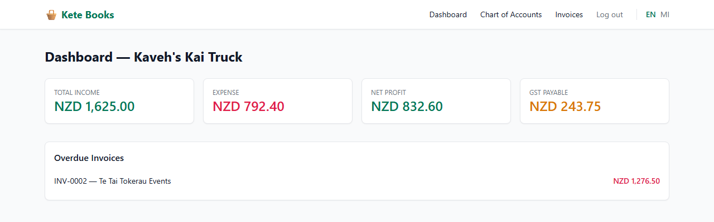
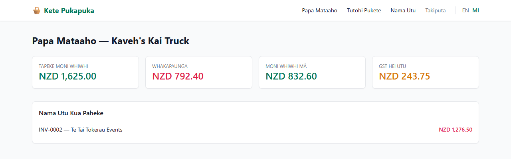
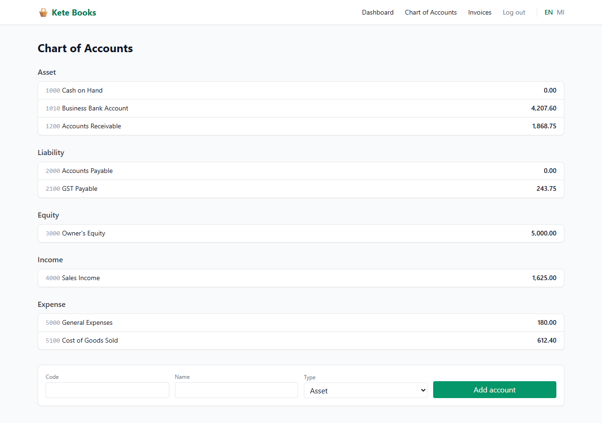
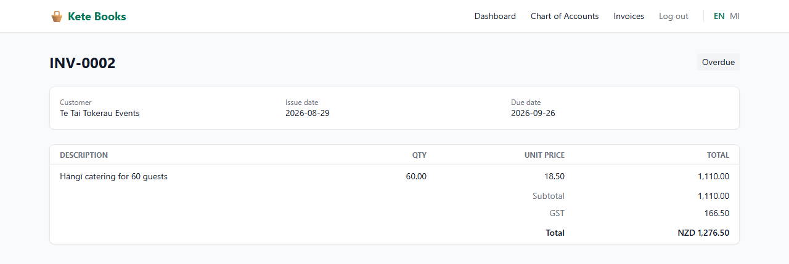
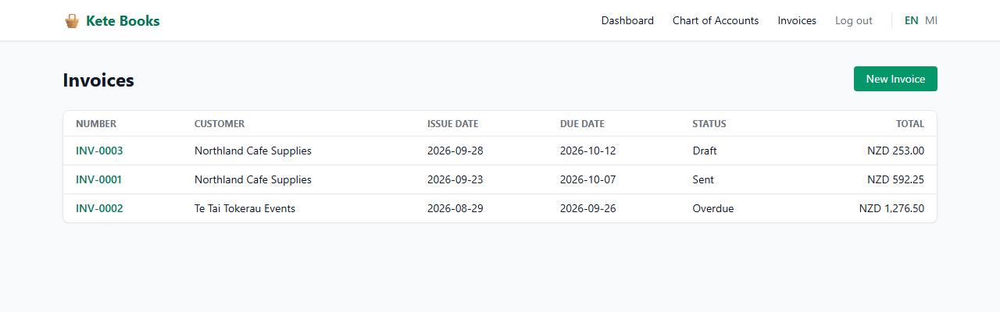

# Kete Books 🧺

[](https://github.com/freeb5d/kete-books/actions/workflows/tests.yml)

A simple, bilingual (**English** / **Te Reo Māori**) accounting system for small businesses, built with **Laravel 12**. Designed as a portfolio piece to show real double-entry bookkeeping logic — not just a CRUD demo.

## Screenshots

| Dashboard (English) | Papa Mataaho (Te Reo Māori) |
|---|---|
|  |  |

| Chart of Accounts | Invoice with GST split |
|---|---|
|  |  |

| Invoices (overdue is derived from the due date) |
|---|
|  |

<sub>Screenshots use the demo data from `DemoSeeder`.</sub>

## Why this project

Most "accounting app" tutorials just have a `transactions` table with a signed amount. Real bookkeeping doesn't work that way — every entry must balance (debits = credits), and account balances depend on the account's type (assets/expenses grow with debits, liabilities/equity/income grow with credits). This project implements that properly:

- **True double-entry ledger** — `transactions` + `transaction_lines`, enforced through a single `LedgerService::postTransaction()` gateway that throws `UnbalancedTransactionException` if debits ≠ credits.
- **NZ GST handling** — invoices split GST into its own `GST Payable` liability account automatically, using the business's configured GST rate (default 15%, NZ standard rate).
- **Bilingual UI (en / mi)** — full route localisation via `mcamara/laravel-localization`, with parallel `lang/en/*.php` and `lang/mi/*.php` files and a language switcher that preserves the current page.
- **Tests that check the accounting, not just the HTTP status** — see `tests/Feature/LedgerServiceTest.php`.

## Stack

- Laravel 12 (PHP 8.2+)
- MySQL (SQLite in-memory for tests)
- `mcamara/laravel-localization` for i18n routing
- TailwindCSS (via CDN in this skeleton — swap for Vite build in production)

## Getting started

```bash
composer install
cp .env.example .env
php artisan key:generate

# create the database, then:
php artisan migrate
php artisan db:seed --class=DemoSeeder   # optional demo data

php artisan serve
```

Log in at `http://localhost:8000/login` as `demo@ketebooks.test` / `password` (after seeding), then visit `http://localhost:8000/en/dashboard` or `http://localhost:8000/mi/dashboard`.

## Running tests

```bash
php artisan test
```

The key test (`LedgerServiceTest`) proves:
1. A balanced transaction posts successfully and account balances update correctly.
2. An unbalanced transaction is **rejected** with `UnbalancedTransactionException`.
3. Issuing a GST-inclusive invoice correctly splits the GST portion into the `GST Payable` liability account, and the resulting journal entry still balances.

`LedgerValidationTest` and `InvoiceControllerTest` also cover:
- entries with one line, zero or negative amounts, both-sided lines, or another business's accounts are rejected;
- amounts are compared in integer cents, so float drift can't break balancing;
- users can't view, send, or bill against another business's invoices or customers (404 / validation error);
- sending an invoice twice posts to the ledger only once, and invoice numbers are sequential and never reused.

## Project structure highlights

```
app/
  Models/         Business, Account, Transaction, TransactionLine, Invoice, InvoiceLine, Customer
  Services/
    LedgerService.php   ← the only place that writes to the ledger
  Exceptions/
    UnbalancedTransactionException.php
database/migrations/     double-entry schema (see comments in each file)
lang/en, lang/mi/        parallel translation files per feature area
tests/Feature/
  LedgerServiceTest.php  accounting-correctness tests
```

## Localisation notes (please read before using in production)

The Māori translations in `lang/mi/*.php` were written to be clear and directionally correct, but **accounting terminology in Te Reo Māori is still an evolving field** without one universally agreed standard. Before using this in front of real Māori-speaking clients:

- Have the strings reviewed by a fluent speaker, ideally one familiar with NZ business/IRD terminology.
- IRD (Inland Revenue) publishes some official bilingual tax terms — worth cross-checking `gst`, `invoice`, `income` equivalents against their glossary.
- Treat the current `mi` files as a solid, respectful first draft, not a certified translation.

## Roadmap ideas (good next PRs for this portfolio piece)

- [ ] Bank statement CSV import + reconciliation matching
- [ ] Profit & Loss and Balance Sheet report pages (the account balance logic is already there in `Account::balance()`)
- [ ] Invoice PDF export (e.g. with `barryvdh/laravel-dompdf`)
- [ ] Multi-currency support beyond the single `currency` field
- [ ] Recurring invoices

## License

MIT — free to use as a base for your own projects.
